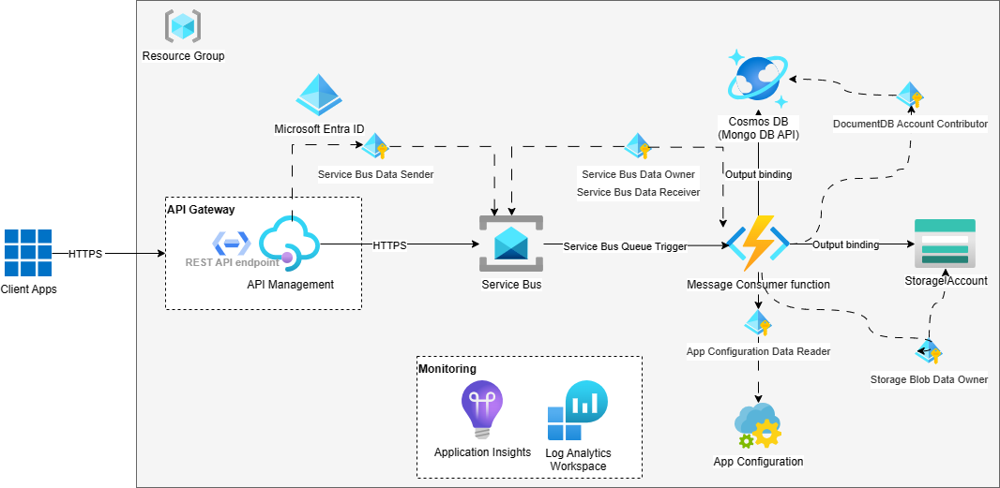

# Azure Service Bus Queue Trigger Function with System Assigned Managed Identity

The purpose of this repository is to demonstrate how to build a Azure Function App triggered by messages from an Azure Service Bus queue while utilizing a System Assigned Managed Identity for secure access to Azure resources. The Managed Identity eliminates the need for explicit credentials, enhancing the application's security and simplifying access management.

This hopefully serves as an educational resource and reference for developers and DevOps professionals looking to implement serverless Azure functions with managed identities and automate Azure infrastructure provisioning using Bicep and GitHub Actions for improved deployment efficiency and reliability.



## Key Features and Components

- **Azure API Management Service**

  - Azure APIM Operation Policies

- **Azure Function App**: Includes the Azure Functions runtime for executing your serverless functions.

- **Service Bus Queue Trigger**: Demonstrates how to set up a Function that triggers in response to messages arriving in an Azure Service Bus queue.

- **Function Multiple Output Bindings**: Blob and cosmos db: https://learn.microsoft.com/en-us/azure/azure-functions/dotnet-isolated-process-guide#multiple-output-bindings

As of now, output binding does not work with Mongo API of Azure Cosmos DB and Managed Identity is in preview.
https://learn.microsoft.com/en-us/azure/azure-functions/functions-bindings-cosmosdb-v2?tabs=isolated-process%2Cextensionv4&pivots=programming-language-csharp#supported-apis
https://learn.microsoft.com/en-us/azure/cosmos-db/how-to-setup-rbac#which-azure-cosmos-db-apis-support-role-based-access-control

- **Azure App Configuration**

- **System Assigned Managed Identity**: Illustrates how to enable and configure a System Assigned Managed Identity for the Function App to securely access other Azure services.

- **Infrastructure as Code with Bicep**: Automates the deployment and provisioning of Azure resources using Bicep, a declarative language for Azure Resource Manager templates.

- **GitHub Actions**: Provides CI/CD automation for deploying the Azure infrastructure automatically whenever changes are pushed to the repository.

## Preparation

1- Create a resource group first:

```powershell
az group create --location canadacentral --name '<resource group name>'
```

2- Create a Service Principal to use for Github Action to create the infrastructure in Azure:

```powershell
az ad sp create-for-rbac --name 'sp-github-dev' --role contributor --scopes '/subscriptions/<subscription id>/resourceGroups/<resource group name>' --json-auth

az role assignment create --assignee '<sp object id>' --role 'Role Based Access Control Administrator (Preview)' --scope 'subscriptions/<subscription id>/resourceGroups/<resource group name>'
```

3- Create Azure AD App registration for API authentication in Azure API Management Service:

```powershell
az ad app create --display-name backend-api --sign-in-audience AzureADMyOrg --app-roles backend-manifest.json
az ad app update --id <backend-api-app-id> --identifier-uris api://<backend-api-app-id>
az ad sp create --id <backend-api-app-id>

az ad app create --display-name client-app --sign-in-audience AzureADMyOrg --required-resource-accesses client-manifest.json
```

Copy the application id and add to github secrets of your repository:

- API_APP_APPID: **Audience**, the backend application which exposes some api and expects to receive the access jwt token
- CLIENT_APP_APPID: **Issuer**, the client application which has access to the exposed api and initiates the access token request

References:

- [Deploy Bicep files by using GitHub Actions](https://learn.microsoft.com/en-us/azure/azure-resource-manager/bicep/deploy-github-actions?tabs=userlevel%2CCLI)
- [Guide for running C# Azure Functions in an isolated worker process](https://learn.microsoft.com/en-us/azure/azure-functions/dotnet-isolated-process-guide)
- [Use identity-based connections instead of secrets with triggers and bindings](https://learn.microsoft.com/en-us/azure/azure-functions/functions-identity-based-connections-tutorial-2)

3- Add required roles to your user to be able to develop locally:

```powershell
az role assignment create --assignee '<user object id>' --role 'Azure Service Bus Data Receiver' --scope '/subscriptions/<subscription id>/resourceGroups/<resource group name>/providers/Microsoft.ServiceBus/namespaces/<service bus namespace>'

az role assignment create --assignee '<user object id>' --role 'Azure Service Bus Data Owner' --scope '/subscriptions/<subscription id>/resourceGroups/<resource group name>/providers/Microsoft.ServiceBus/namespaces/<service bus namespace>'

az role assignment create --assignee '<user object id>' --role 'App Configuration Data Reader' --scope '/subscriptions/<subscription id>/resourceGroups/<resource group name>/providers/Microsoft.AppConfiguration/configurationStores/<app configuration name>'

az role assignment create --assignee '<user object id>' --role 'Storage Blob Data Owner' --scope '/subscriptions/<subscription id>/resourceGroups/<resource group name>/providers/Microsoft.Storage/storageAccounts/<storage account name>'

az role assignment create --assignee '<user object id>' --role 'DocumentDB Account Contributor' --scope '/subscriptions/<subscription id>/resourceGroups/<resource group name>/providers/Microsoft.DocumentDB/databaseAccounts/<cosmos db account name>'
```

4- Run the gihub action to create the Azure environment in your Azure subscription.

## Local development environment

Add the following to your **local.settings.json**:

```json
{
  "IsEncrypted": false,
  "Values": {
    "AzureWebJobsStorage": "UseDevelopmentStorage=true",
    "FUNCTIONS_WORKER_RUNTIME": "dotnet-isolated",
    "AppConfigConnection": "https://<app configuration name>.azconfig.io",
    "AppConfigConnection__clientId": "<user object id>",
    "ServiceBusConnection__fullyQualifiedNamespace": "<service bus namespace>.servicebus.windows.net",
    "ServiceBusConnection__clientId": "<user object id>",
    "ServiceBusQueue": "<queue name>",
    "ArchiveBlobConnection__blobServiceUri": "https://<storage account name>.blob.core.windows.net/",
    "ArchiveBlobConnection__clientId": "<user object id>",
    "CosmosDBConnection__accountEndpoint": "https://<cosmos db account name>.mongo.cosmos.azure.com:443/",
    "CosmosDBConnection__clientId": "<user object id>",
    "CosmosDbDatabase": "<cosmos db database name>",
    "CosmosDbContainer": "<cosmos db collection name>",
    "AZURE_CLIENT_ID": "<user object id>",
    "AZURE_TENANT_ID": "<azure tenant id>"
  }
}
```
